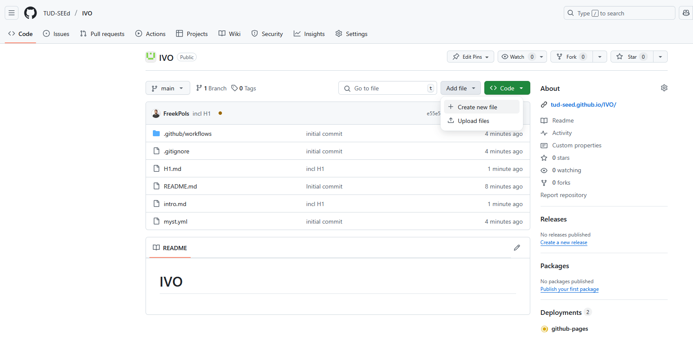
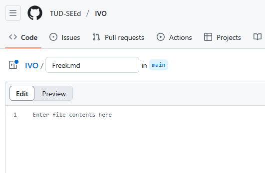

# Introductie

Welkom bij Jupyter Book van IVO! In deze opdracht ga je aan de slag met zelf een pagina 'ontwerpen'.

* Ga naar de website van [Github](https://github.com) en maak een account aan als je dat nog niet hebt.
* Geef je accountnaam door aan de docent, z/hij voegt jou toe aan het boek.
* Als je toegang hebt, kun je aan de slag met een eigen hoofdstuk maken. De repo waar je toegang toe krijgt vind je [hier](https://github.com/TUD-SEEd/IVO).
* Klik op *Add file* en *Create a new file*, zie hieronder.



* Geef je file een naam met als extensie *.md* bijv. *Freek.md*



* In die file kun je jouw inhoud stoppen / ontwikkelen. 
* Maak een hoofdstuk titel (# Mijn eerste titel) en een section titel (## Mijn eerste sectie). 
* Druk op de groene *Commit changes* knop om je aanpassingen door te zetten naar de repo. Je kunt de commit een passende titel geven (of niet).

Wat er nu gebeurd is dat het boek opnieuw gemaakt wordt en via GitHub pages gepubliceerd. Na ongeveer 2 minuten kun je dus het resultaat op de website zien!

* Bekijk eens op de site van [Jupyter Book](https://jupyterbook.org/en/stable/content/index.html) naar wat je allemaal kunt toevoegen en pas dat aan in je eigen gemaakte hoofdstuk: klik daartoe op je gemaakte hoofdstuk en dan op het pennetje aan de rechterkant (*edit this file*)
* Je kunt natuurlijk ook de features bekijken in het volgende hoofdstuk.
* En heb je de smaak te pakken? Volg onderstaande stappen om je eigen repository op te zetten!
* Succes!

```{note}
Goed om te weten... dit boek is gemaakt in [MyST](https://mystmd.org/guide) de meest recente versie van Jupyter Books.
```

## Eigen repository opzetten
Volg de volgende stappen om je eigen repository op te zetten. 

1. Ga naar deze [repository](https://github.com/TUD-SEEd/template.git)
2. Klik op de groene `use this template` en klik `create a new repository`.
3. Kies de naam voor je repository, en kies voor de optie `public`.
4. In je repository, klik links op pages en kies voor `Github actions`

``` {figure} ../Figuren/set_up_pages.png
```

5. Klik op `code` en klik op het tandwiel (bij **About**) aan de rechterkant van het scherm. 
6. Vink **Use your GitHub Pages website** aan.
7. Ga naar actions in het bovenste menu, klik op de (rode) `initial commit` en klik op `re-run all jobs`

Het boek wordt nu nog een keer aangemaakt en ingeladen met GitHub pages. 

```{figure} ../Figuren/rerunjobs.PNG
---
name: fig_rerun
width: 70%
---
Als het boek bouw proces klaar is zijn alle bolletjes groen gekleurd.
```

8. Ga via de link (code, rechterkant onder **About**) naar de GitHub page waar het boek online gezet wordt.
9. De output is gelijk aan {numref}`Figuur {number} <fig_templatebook>` hieronder.

``` {figure} ../Figuren/templateboekoutput.PNG
---
name: fig_templatebook
width: 100%
---
De output van het boek zoals dat op GitHub pages staat.
```

```{tip}
Hulp nodig? Nodig FreekPols uit voor je repository zodat hij mee kan kijken!
```